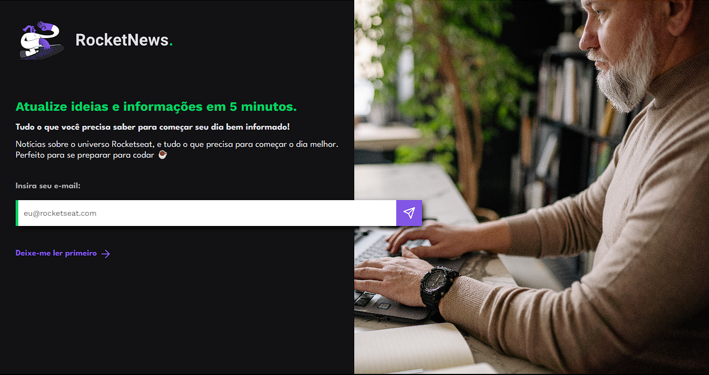

Projeto criado com o obetivo de consolidar e aprimorar os aprendizados de HTML e estilos CSS obtidos no curso 'Discover', concluindo o desafio "RocketNews" da Rocketseat.

Durante a realização desse projeto, pratiquei a utilização de formulários e seus atributos básicos, como 'placeholder', 'pattern', 'length' e 'title', além de aprimorar meus conhecimentos em CSS através da utilização de pseudoelementos.

Demonstração da página concluída (ainda sem responsividade):

Link do layout no Figma: https://www.figma.com/community/file/1241119530230478440/RocketNews-%E2%80%A2-Desafio-Discover